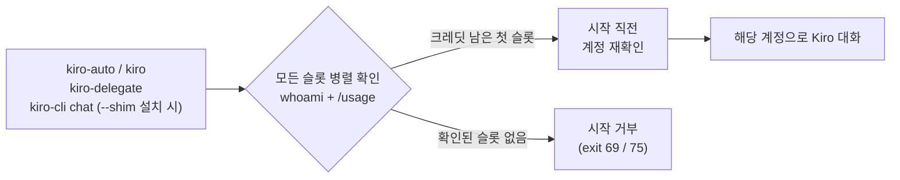

<div align="center">

# kiro-account-router

**여러 Kiro 계정을 로그인/로그아웃 없이 번갈아 쓰기.**

Linux / WSL에서 [Kiro CLI](https://kiro.dev/cli/)를 쓸 때, 대화를 시작하기 직전에
크레딧이 남아 있는 계정을 자동으로 골라 주는 도구입니다.

[](https://github.com/beyondfashion-ai/kiro-account-router/actions/workflows/ci.yml)
[](LICENSE)


[English](README.md) · 한국어

</div>

---

```text
$ kiro-auto accounts
* 1) wsl (wsl)              alice@example.com       115.96/5000      available
  2) windows (windows)      bob@example.com         864.80/2000      available
  3) second (wsl, extra)    carol@example.com       2000/2000        full
* = auto choice
```

## 왜 필요한가

Kiro CLI는 **설치본 하나에 로그인 하나**만 유지합니다. 계정이 여러 개면(예: 회사
계정과 개인 계정, 각자 크레딧 따로) 한쪽 크레딧이 떨어질 때마다 `logout` /
`login`을 반복해야 하고, `kiro-cli`를 직접 부르는 다른 도구(Codex, Claude Code,
스크립트)는 계속 소진된 계정으로 갑니다.

kiro-account-router는 로그인이 저장될 수 있는 각 위치를 **슬롯**으로 보고, 대화
시작 전에 모든 슬롯을 확인해 크레딧이 남은 첫 슬롯을 사용합니다. 계정을 코드에
고정하지 않고, 이미 시작된 대화를 다른 계정으로 다시 보내지도 않습니다.

## 동작 방식



| 슬롯 종류 | 로그인 위치 |
|---|---|
| `wsl` | Linux Kiro CLI (기본 위치, 또는 슬롯별 별도 `XDG_DATA_HOME`) |
| `windows` | Windows Kiro CLI (`kiro-cli.exe`, WSL interop 경유) |

## 주요 기능

- **자동 선택**: 모든 슬롯을 병렬로 확인하고, 우선순위 순으로 크레딧이 남은 첫 슬롯 사용
- **대화형 선택 화면**: 터미널에서 `kiro-auto`를 실행하면 계정·크레딧 목록이 뜸.
  Enter(또는 30초)는 자동 선택, 번호는 직접 선택, `l번호`/`o번호`는 로그인/로그아웃, `a`는 계정 추가
- **계정 추가**: `kiro-auto account add second` 로 기존 로그인과 별개인 WSL 슬롯 추가
- **다른 도구 호출도 라우팅** (선택, `./install.sh --shim`): `kiro-cli chat`,
  `kiro-cli`, `kiro-cli --resume`, `translate`, `acp` 등 모델을 쓰는 호출을 모두 계정 선택기로 보냄
- **비대화형 래퍼** `kiro-delegate`: stdout에는 모델 답변만, 프롬프트는 stdin으로, Kiro 종료코드 유지
- **안전 우선**: 크레딧을 확인할 수 없으면 추측하지 않고 시작하지 않음. 시작 직전 계정을 다시 확인
- **재전송 없음**: 이미 시작된 대화는 절대 다른 계정으로 다시 보내지 않음
- **빠른 시작**: 확인 결과를 5분간 재사용해서, 보통은 계정 확인(1~2초)만 하고 바로 시작
  (`kiro-auto accounts --refresh` 로 강제 재확인)
- **순수 bash**: 런타임 불필요, 오프라인 테스트 100개 이상을 CI에서 실행

## 설치

요구사항: Linux 또는 WSL2, bash 4+, `tmux`, `perl`, `awk`, `sed`, `seq`, `flock`,
`timeout`, 그리고 `~/.local/bin/kiro-cli` 에 설치된 Kiro CLI.
Windows Kiro CLI(`C:\Users\<사용자>\AppData\Local\Kiro-Cli\`)는 자동 감지됩니다.

```bash
git clone https://github.com/beyondfashion-ai/kiro-account-router.git
cd kiro-account-router
./install.sh            # 다른 도구의 kiro-cli 호출까지 라우팅하려면 --shim 추가
```

빠른 시작:

```bash
kiro-auto accounts               # 슬롯·계정·크레딧 확인
kiro-auto account add second     # (선택) WSL 로그인 슬롯 추가
kiro-auto login second           # 그 슬롯에 로그인
kiro-auto                        # 계정 선택 후 대화 시작
```

`kiro` 로 짧게 쓰려면 셸 설정에 추가하세요.

```bash
# ~/.bashrc 또는 ~/.zshrc
kiro() { command "$HOME/.local/bin/kiro-auto" "$@"; }
```

`--shim` 설치 시 진짜 실행파일은 `~/.local/bin/kiro-cli-real` 로 옮겨지고,
`kiro-cli update` 후에도 자동으로 복구됩니다. `./uninstall.sh` 로 원상 복구됩니다.

## 사용법

```text
kiro                      계정 선택 화면 → 대화
kiro @NAME [args]         특정 슬롯으로 대화 (이름 또는 `kiro accounts` 의 번호)
kiro accounts [--refresh] 슬롯 목록 (계정, 크레딧, 상태, 5분 캐시)
kiro use NAME|auto        우선 슬롯 지정 / 해제
kiro login|logout NAME    슬롯 로그인 / 로그아웃
kiro whoami [NAME]        로그인된 계정 확인
kiro account add NAME     WSL 로그인 슬롯 추가
kiro account rm NAME      슬롯 제거
```

비대화형 호출:

```bash
kiro-delegate --model MODEL --trust-read --prompt-file task.md
printf '%s' 'Reply only: OK' | kiro-delegate --model MODEL --no-tools
```

민감한 프롬프트는 stdin이나 `--prompt-file` 로 넘기세요. `--prompt TEXT` 는 래퍼의
프로세스 인자에 보입니다.

설정 파일(`~/.config/kiro-auto/slots`), 환경변수, 종료코드, 안전장치, 알려진 한계는
[영문 README](README.md#configuration)에 자세히 정리되어 있습니다.

## 테스트

```bash
bash test/run.sh
```

가짜 Kiro CLI로 동작하므로 계정이나 네트워크가 필요 없습니다.

## 면책

AWS나 Kiro와 무관한 비공식 도구입니다. Kiro CLI의 출력 형식에 의존하므로 CLI
업데이트로 동작이 바뀔 수 있습니다. 사용하는 계정의 Kiro/AWS 약관을 따르세요.

## 라이선스

[MIT](LICENSE) © beyondfashion-ai
