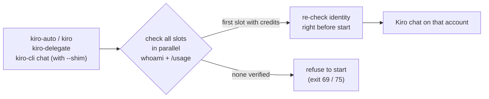

<div align="center">

# kiro-account-router

**Use every Kiro account you have, without logging in and out.**

Usage-aware account routing for [Kiro CLI](https://kiro.dev/cli/) on Linux / WSL.
Each chat starts on a logged-in account that still has credits.

[](https://github.com/beyondfashion-ai/kiro-account-router/actions/workflows/ci.yml)
[](LICENSE)


English · [한국어](README.ko.md)

</div>

---

```text
$ kiro-auto accounts
* 1) wsl (wsl)              alice@example.com       115.96/5000      available
  2) windows (windows)      bob@example.com         864.80/2000      available
  3) second (wsl, extra)    carol@example.com       2000/2000        full
* = auto choice

$ kiro-auto
Enter=wsl (auto, chosen after 30s)  N=use slot  lN=login  oN=logout  a=add account  r=refresh  q=quit
> 
Kiro account: alice@example.com [wsl (wsl)]
```

## Why

Kiro CLI keeps **one login per installation**. If you have several accounts
(say a work account and a personal one, each with its own included credits),
you end up running `logout` / `login` whenever one runs dry, and every other
tool that calls `kiro-cli` (Codex, Claude Code, scripts) keeps hitting the
exhausted one.

kiro-account-router treats each place a login can live as a **slot**, checks
all slots before a chat starts, and picks the first one that still has
credits. No hardcoded accounts, no replayed prompts.

## How it works



| Slot kind | Where the login lives |
|---|---|
| `wsl` | the Linux Kiro CLI (default data dir, or an extra `XDG_DATA_HOME` dir per slot) |
| `windows` | the Windows Kiro CLI (`kiro-cli.exe`), called through WSL interop |

Whatever account is logged in to a slot is used, unless you pin a slot to one
email.

## Features

- **Automatic selection**: slots are checked in parallel (`whoami` + `/usage`);
  the first slot in preference order with remaining credits is used.
- **Interactive picker**: running `kiro-auto` in a terminal shows every slot
  with its account and credits. Press Enter (or wait 30 s) for the auto choice,
  or pick, log in, log out, or add an account right there.
- **More accounts, no juggling**: `kiro-auto account add second` creates a new
  WSL login slot next to your existing login.
- **Works for other tools too** (opt-in, `./install.sh --shim`): a shim at
  `~/.local/bin/kiro-cli` routes every model-using call from other agents
  through the selector with their flags unchanged: `kiro-cli chat`, implicit
  chats (`kiro-cli`, `kiro-cli --resume`, `kiro-cli --agent X`), `translate`,
  and `acp`. Other subcommands go straight to the real CLI.
- **Headless wrapper**: `kiro-delegate` gives other agents clean stdout, the
  prompt on stdin, and Kiro's exit code.
- **Fails closed**: automatic selection never guesses. If no slot's remaining
  credits can be verified, nothing is started. (An explicit choice, `kiro @NAME`
  or picking a slot by number, is honored even when its usage is unknown; the
  account itself is always verified.)
- **No replay**: selection happens only before a chat starts. A chat that has
  started is never re-sent to another account, so output and tool actions are
  never duplicated.
- **Plain bash**: no runtime, no package manager; 100+ offline tests in CI.

## Contents

- [Requirements](#requirements) · [Install](#install) · [Usage](#usage) ·
  [Configuration](#configuration) · [Safety checks](#safety-checks) ·
  [Known limitations](#known-limitations) · [Tests](#tests)

## Requirements

- Linux or WSL2 with bash 4+, `tmux`, `perl`, `awk`, `sed`, `seq`, `flock`,
  `timeout` (coreutils / util-linux)
- Kiro CLI installed at `~/.local/bin/kiro-cli`
- Optional: Windows Kiro CLI under `C:\Users\<you>\AppData\Local\Kiro-Cli\`.
  If exactly one Windows profile has it, it is used; with several profiles the
  current Windows user's `%LOCALAPPDATA%` is used. Set `KIRO_AUTO_WINDOWS_CLI`
  to be explicit.

## Install

```bash
git clone https://github.com/beyondfashion-ai/kiro-account-router.git
cd kiro-account-router
./install.sh            # add --shim to also route raw `kiro-cli` calls (see below)
```

Quick start:

```bash
kiro-auto accounts               # see slots, accounts, credits
kiro-auto account add second     # optional: add a second WSL login slot
kiro-auto login second           # log that slot in
kiro-auto                        # pick an account and start a chat
```

The examples below use `kiro`; add this shell function to get it:

```bash
# ~/.bashrc or ~/.zshrc
kiro() { command "$HOME/.local/bin/kiro-auto" "$@"; }
```

### The `kiro-cli` shim (opt-in)

Without the shim, only `kiro-auto` / `kiro` and `kiro-delegate` are routed;
other tools that call `kiro-cli` directly keep using its default login. With
`./install.sh --shim`, the real binary is moved to `~/.local/bin/kiro-cli-real`.
`kiro-cli update` (and `kiro update`) runs through `kiro-auto`, which reinstalls
the shim afterwards. If something else overwrites `kiro-cli`, direct
`kiro-cli` calls bypass routing until the next `kiro` / `kiro-auto` /
`kiro-delegate` run repairs it (the replaced binary is kept as
`kiro-cli-real.prev`). `./uninstall.sh` restores the real binary.
Running `./install.sh` without `--shim` later removes the shim again and moves
the real binary back.

## Usage

```text
kiro                      interactive account picker, then chat
kiro @NAME [args]         chat on a specific slot (NAME or the number shown by `kiro accounts`)
kiro accounts             list slots with account, credits, state
kiro use NAME|auto        set / clear the preferred slot
kiro login|logout NAME    log in / out of one slot (no NAME: choose on a terminal;
                          inside a routed chat: that chat's slot; otherwise required)
kiro whoami [NAME]        show logged-in accounts
kiro account add NAME     add an extra WSL login slot
kiro account rm NAME      remove a slot from the list
```

Example:

```text
$ kiro accounts
* 1) wsl (wsl)              alice@example.com       115.96/5000      available
  2) windows (windows)      bob@example.com         864.80/2000      available
  3) second (wsl, extra)    -                       -                not-logged-in
* = auto choice
```

### Non-interactive calls

`kiro-delegate` is a wrapper for headless use from other tools. It uses the
v2 agent engine, requires `--model`, defaults to read-only tools, and prints
selector diagnostics to stderr only, so stdout contains just the model output.
The prompt is passed to Kiro on stdin. Use stdin or `--prompt-file` for
confidential prompts: `--prompt TEXT` is visible in the wrapper's own process
arguments.

```bash
kiro-delegate --model MODEL --trust-read --prompt 'Review this diff.'
kiro-delegate --model MODEL --trust-all-tools --prompt-file task.md
printf '%s' 'Reply only: OK' | kiro-delegate --model MODEL --no-tools
```

`kiro-delegate` sets the model via the selected installation's
`chat.defaultModel` (under an `flock` lock) instead of `--model`, because some
Kiro CLI releases ignore `--model` in headless mode. Because the setting is
global per installation, it changes the default model for that installation.

## Configuration

The slots file is `~/.config/kiro-auto/slots`. Line order is the default
preference:

```text
# name      kind      data_dir  pin_email
wsl         wsl       -         -
windows     windows   -         -
second      wsl       /home/me/.local/share/kiro-auto/slots/second  -
```

Set `pin_email` to an address to refuse any other account in that slot.

| Variable | Effect |
|---|---|
| `KIRO_AUTO_FORCE=NAME` | always use one slot |
| `KIRO_AUTO_PREFER=NAME` | try this slot first (same as `kiro use`) |
| `KIRO_AUTO_PICKER=0` | skip the interactive picker |
| `KIRO_AUTO_PICKER_TIMEOUT=30` | seconds before the picker auto-selects (counted after the checks finish) |
| `KIRO_AUTO_PROBE_DEADLINE=45` | max seconds for one round of account checks; slots not done by then are `unknown` |
| `KIRO_AUTO_MODEL` | default `--model` for chats (unset = Kiro's own default) |
| `KIRO_AUTO_AGENT` / `KIRO_AUTO_TRUST_ALL=1` | default `--agent` / `--trust-all-tools` for interactive chats |
| `KIRO_AUTO_WINDOWS_CLI` | path to `kiro-cli.exe` |
| `KIRO_AUTO_WSL_CLI` | path to the real Linux `kiro-cli` (nonstandard installs) |
| `KIRO_AUTO_BYPASS=1` | shim calls the real binary directly |
| `KIRO_AUTO_DRY_RUN=1` | print the command instead of running it |

Exit codes: `69` no verified slot, `75` all slots out of credits, `78` forced
slot unavailable, `73`/`74` model lock or model setting failed.

## Safety checks

- Right before a chat starts, the slot's account is checked again; if it
  changed since the usage check (a login/logout elsewhere), the chat is not
  started (exit `78`).
- `install.sh` refuses to overwrite a same-named `kiro-auto` / `kiro-usage` /
  `kiro-delegate` that it did not install, and `uninstall.sh` removes only its
  own files (they carry a `Part of kiro-account-router` header).
- `kiro update` runs under the same lock as install/uninstall. If the update
  fails, the known-good binary stays active; if the shim cannot be restored,
  the command exits `70`.

## How usage is read

`/usage` is a TUI command in Kiro CLI; sending it with `--no-interactive`
treats it as a prompt. `kiro-usage` starts Kiro in a short-lived detached tmux
session, types `/usage`, reads the panel, and kills the session. Only this
read-only probe and short Windows interop commands (`whoami`, settings) are
retried; a chat is never retried.

Settings (`~/.kiro`) are shared by all `wsl` slots; only the login data
(`XDG_DATA_HOME`) is separate. Large runtime files are symlinked from the
default data dir into extra slots.

## Tests

```bash
bash test/run.sh
```

The tests use a fake Kiro CLI and a fake usage probe. They need no account and
make no network calls.

## Known limitations

- Depends on Kiro CLI surface details: `whoami` printing `Email: ...`, the
  `--legacy-ui chat` TUI showing `ask a question or describe a task` when
  ready, and the `/usage` panel's `Credits (X of Y covered in plan)` line. A CLI
  release that changes these makes usage `unknown`, and automatic selection
  then refuses to start. `kiro-delegate` forces `--agent-engine v2`.
- Tested with Kiro CLI 2.18.1 (Linux) and 2.24.1 (Windows); other versions
  are untested.
- Checking usage opens a short Kiro TUI session per slot, in parallel (usually
  10-20 s, capped by `KIRO_AUTO_PROBE_DEADLINE`).
- Raw `kiro-cli chat --model X` calls are passed through unchanged; whether
  `--model` is honored depends on the Kiro CLI release.
- While `kiro update` runs, the updater may briefly put the new binary at
  `kiro-cli`; a direct `kiro-cli` call at that exact moment bypasses routing.
- The shim recognizes its own files by a marker string; do not copy that
  marker into unrelated scripts at the same paths.

## Disclaimer

This is an unofficial tool, not affiliated with AWS or Kiro. It relies on
Kiro CLI output formats (`Email:` from `whoami`, the `/usage` panel) that may
change. Follow your Kiro/AWS terms for the accounts you use.

## Contributing and security

Issues and pull requests are welcome. See [CONTRIBUTING.md](CONTRIBUTING.md),
[SECURITY.md](SECURITY.md) for private vulnerability reports, and
[CHANGELOG.md](CHANGELOG.md) for release notes.

## License

[MIT](LICENSE) © beyondfashion-ai
